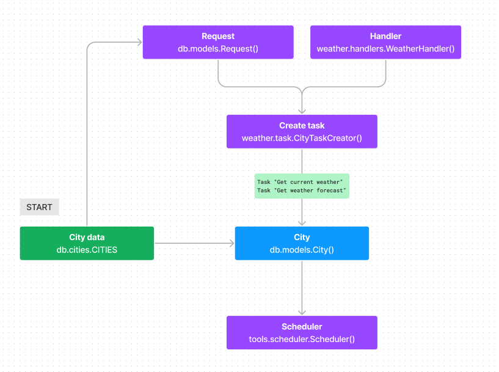

# Задание

> **Задача от бизнеса звучит так:**  
> “Нам нужно иметь данные о погоде в 50 крупнейших городах мира, на основании
> этих
> данных мы будем управлять мощностями Дата-центров в плане охлаждения и
> нагрузки”.

> **Уточнение задачи от лида:**  
> “Напиши Коллектор (сущность, отвечающую за сбор статистики)
> для https://openweathermap.org/, который должен каждый час собирать информацию
> о
> погоде для 50 крупнейших городов мира, после чего сохранять значение в БД. При
> сборе обрати внимание на побочные данные, которые можно получить, можем ли мы
> их
> для чего-то использовать? При написании следует учитывать, что код может часто
> меняться, поэтому следует подумать о его расширении и дальнейшей поддержке.
> Выбор технологий на твое усмотрение.”

[ссылка](https://docs.google.com/document/d/1JEkSYpoR43cNAt3sYsmh8OHSL11YHJSKRaR9HWUMhFY/mobilebasic)

# Проект «Weather Collector» для DataFort

## 📌 Описание

- Получаемые данные:
    - Прогноз на 5
      дней [openweathermap.org/forecast5](https://openweathermap.org/forecast5)  
      БД: `weather_collector`  
      Коллекция: `current_weather`
    - Текущая
      погода [openweathermap.org/current](https://openweathermap.org/current)  
      БД: `weather_collector`  
      Коллекция: `five_day_weather_forecast`  
      (для оценки качества прогнозов в будущем)

В зависимости от того как спроектирован Дата-центр и того как данные будут
анализироваться, может пригодится бОльшая часть получаемой информации от
[openweathermap.org](https://openweathermap.org), если не вся.

Данные сохраняются как есть, только к каждому документу добавляется наш
`city_id`. При этом в родительском классе
обработчиков `handlers.WeatherHandler._data_cleaner` реализован метод очистки
данных, если потребуется.



## 📌 Структура проекта

- 📁`data/`
    - 📄`cities.json` — входные данные по 50 крупнейшим городам.
- 📁`src/` — кодовая база.
    - 📁`db`
        - 📄`cities.py` — модуль загрузка данных городов.
        - 📄`models.py` — модели всех сущностей.
        - 📄`mongodb.py` — интерфейс к MongoDB.
    - 📁`tools`
        - 📄`requestor.py` — модуль для http запросов по городам.
        - 📄`scheduler.py` — планировщик задач.
    - 📁`weather`
        - 📄`handlers.py` — обработчики данных (очистка, сохранение в БД).
        - 📄`task.py` — создание задач (запросов) для города.
    - 📄`config.py`
    - 📄`main.py`

## 📌 Запуск

1. Переименовать `.env.template` в `.env`  
   1.1 (Опционально) В `.env` файле прописать свой API ключ
   [openweathermap.org](https://openweathermap.org) в `OPENWEATHERMAP_API_KEY`
2. `make up`

## 📌 Настройки сервиса (.env)

```dotenv
# Сколько раз в сутки будет выполняться сбор данных о погоде по всем городам
# 24 — каждый час
REQUESTS_PER_DAY=24

# Задержка между запросами (антифлуд)
DELAY_BETWEEN_REQUESTS=0.1

# Путь до `cities.json` с данными городов
CITY_JSON="../data/cities.json"
```

## 📌 Получение списка 50 городов из ChatGPT

```prompt
1.
Нужен JSON, в котором будет список 20 крупнейших городов мира.
Пример структуры 1 элемента списка: {"city_id": 1, "city_name": "Moscow", "country": "Russia", "lat": 19.07, "lon": 72.87}.
Номер города в списке, название города, название страны и координаты. Названия на английском языке.

2.
Следующие 20 в списке

3.
Следующие 10 в списке
```

> 💬 Добавлен параметр `city_id` на случай, если список увеличится и появятся
> города с одинаковыми названиями. Так же при большом объеме данных по `id`
> типа `int` поиск записей в БД может быть быстрее.

## 📌 Дополнение

### Обоснования технологий

- MongoDB
    - Получаем данные в виде неплоского JSON
    - Нет связей/отношений
    - простой insert данных
    - одна строка кода python и можно работать с БД

### Ограничения

- Не знает историю по запросам. При каждом запуске приложение сразу делает
  запрос погоды. В случае рестарта контейнера, приложение снова сделает запрос
  погоды по всем городам.

- При дефолтных настройках `REQUESTS_PER_DAY=24` и `DELAY_BETWEEN_REQUESTS=0.1`
  и двух запросах на 1 город (текущая погода и прогноз), скорость будет 5
  городов/с или 18000 городов/час. Не желательно загружать более 18к городов при
  текущих настройках.
